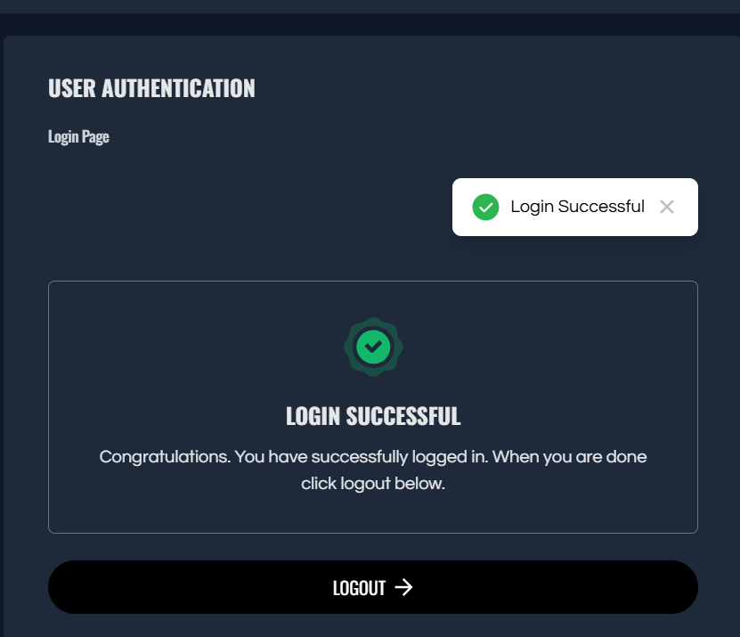
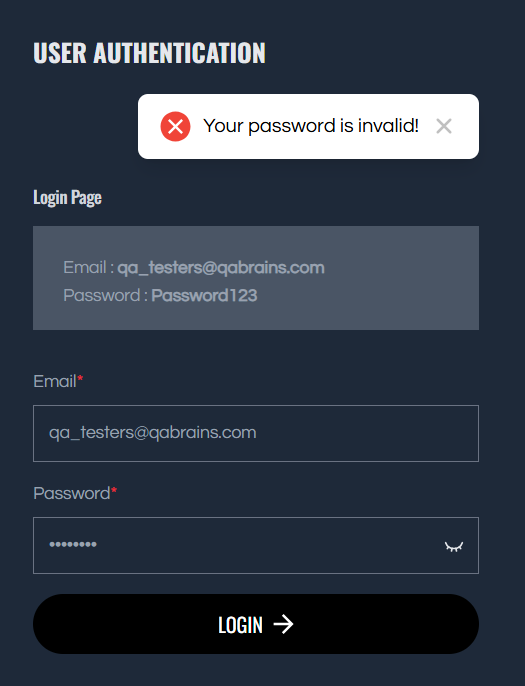

# Manual-Testing-Project-User-Authentication-Login-Module

## 📌 Project Overview
This project focuses on **manual testing of the User Authentication (Login) module** of a demo web application.  
The objective is to verify that the login functionality works correctly under different scenarios and meets expected quality standards.

---

## 🌐 Application Tested
QA Brains – Demo Practice Website  
Module: User Authentication (Login)

---

## 🎯 Scope of Testing
- Login functionality testing  
- Email and password field validations  
- Positive and negative test scenarios  
- Error message validation  
- Basic security testing (invalid inputs, SQL injection attempt)  
- UI and usability checks  

---

## 🧪 Testing Activities Performed
- Designed and executed **15+ manual test cases**
- Covered functional, validation, and negative scenarios
- Verified input behavior and system responses
- Documented test results and execution status
- Identified issues and created sample bug reports
- Captured screenshots as test evidence

---

## 📂 Test Artifacts Included
- Test Cases (Excel)
- Bug Report (Sample)
- Test Execution Screenshots
- Project Documentation (README)

---

## 🛠 Tools & Technologies Used
- Manual Testing  
- MS Excel (Test cases & bug reports)  
- Web Browsers: Chrome  

---

## 📸 Test Execution Screenshots

### ✅ Successful Login

### ❌ Failed Login (Invalid Credentials)

---

## 📊 Test Results
- All planned test cases were executed successfully
- Login functionality behaved as expected for valid inputs
- Proper validation messages were displayed for invalid inputs
- Defects were documented for learning and practice purposes

---

## 📘 Key Learnings
- Hands-on experience with manual testing process
- Test case design and execution techniques
- Defect reporting with severity and priority
- Importance of validation and negative testing
- Real-world QA documentation practices

---

